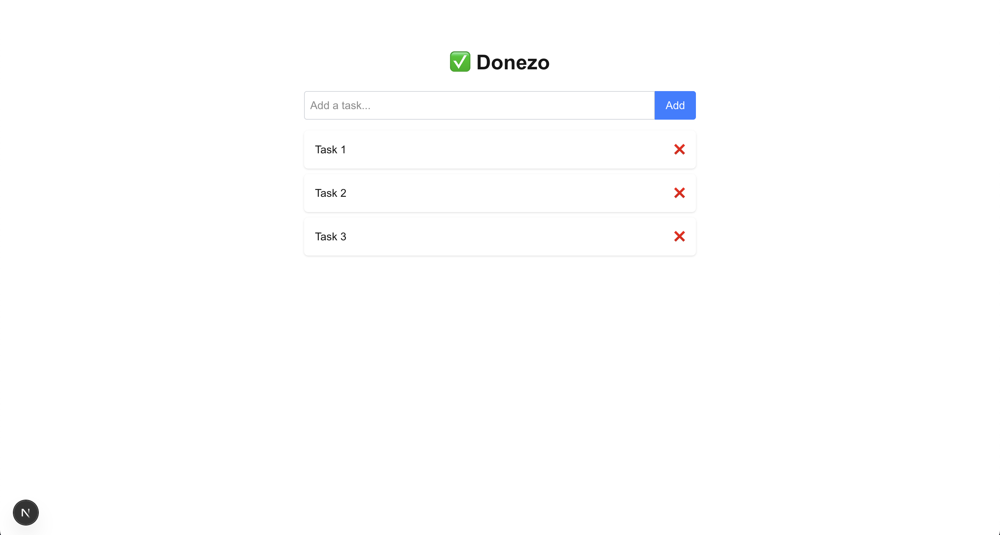
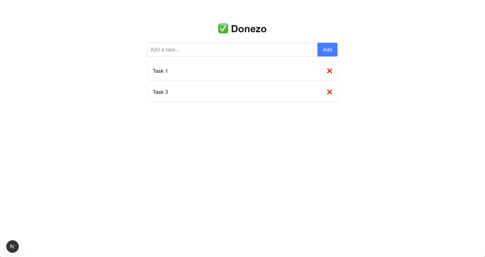

# Donezo
A sleek, modern To-Do List app built with Next.js and Redux Toolkit. Organize your tasks, manage your productivity, and keep things Donezo

>Goal: To learn Next.js and Redux through building a practical project.




## Features
- Add, edit, and delete tasks
- Mark tasks as complete/incomplete
- Persist state using Redux
- Lightning-fast with Next.js SSR/SSG
- Styled with Tailwind

## Tech Stack
- Next.js
- Redux Toolkit
- React Redux
- TypeScript
- Tailwind CSS

## Installation
```bash
# Clone the repo
git clone https://github.com/AritraC1/donezo.git
cd donezo

# Install dependencies
npm install

# Run the dev server
npm run dev
```
Visit http://localhost:3000 to use the app.

## Project Structure
```bash
/pages        → Next.js pages  
/components   → Reusable UI components  
/redux        → Redux slices & store setup  
/styles       → Global styles or Tailwind config  
```
>Notes: This app was created as a learning project to gain hands-on experience with Next.js and Redux.